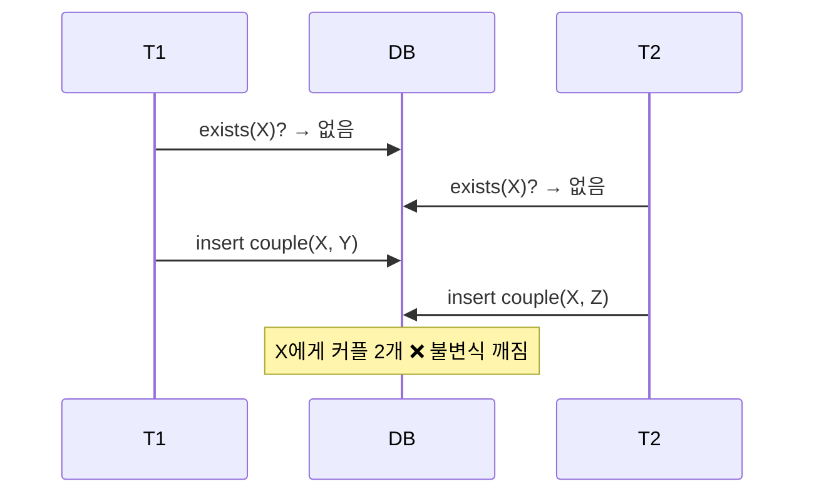
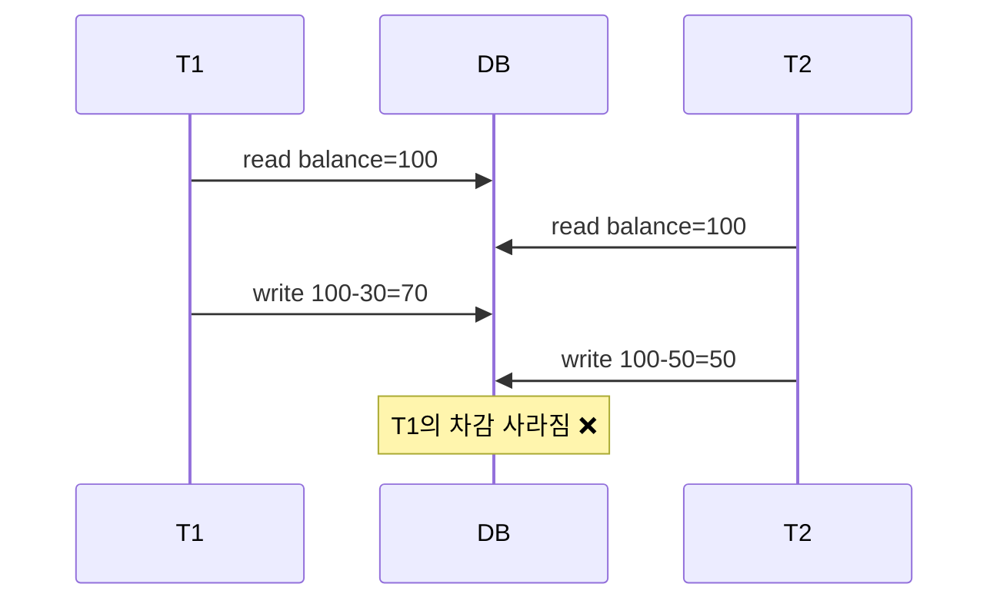
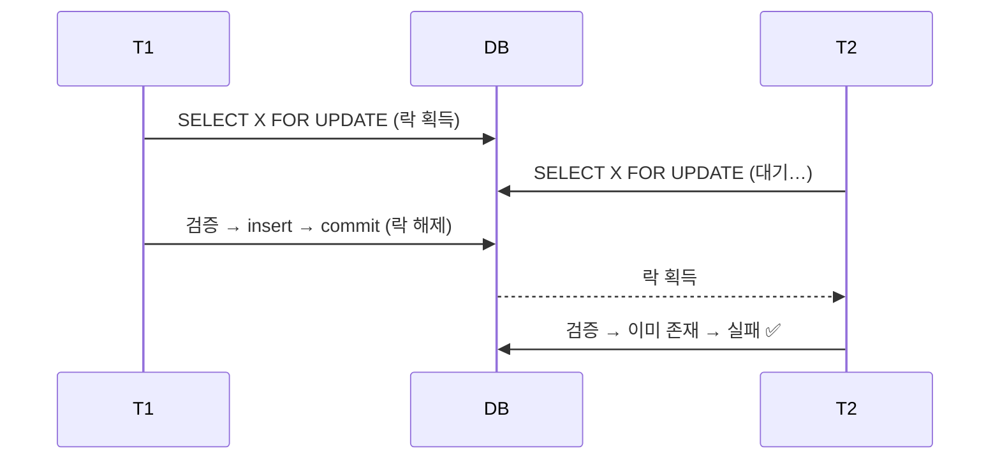
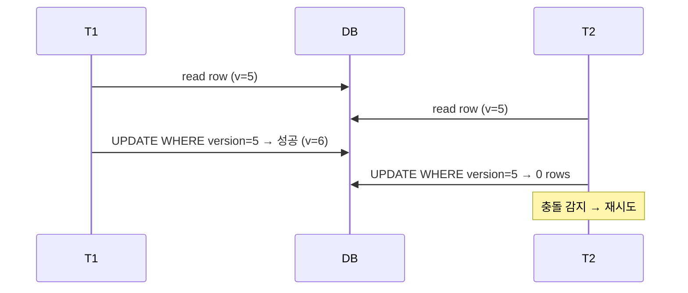
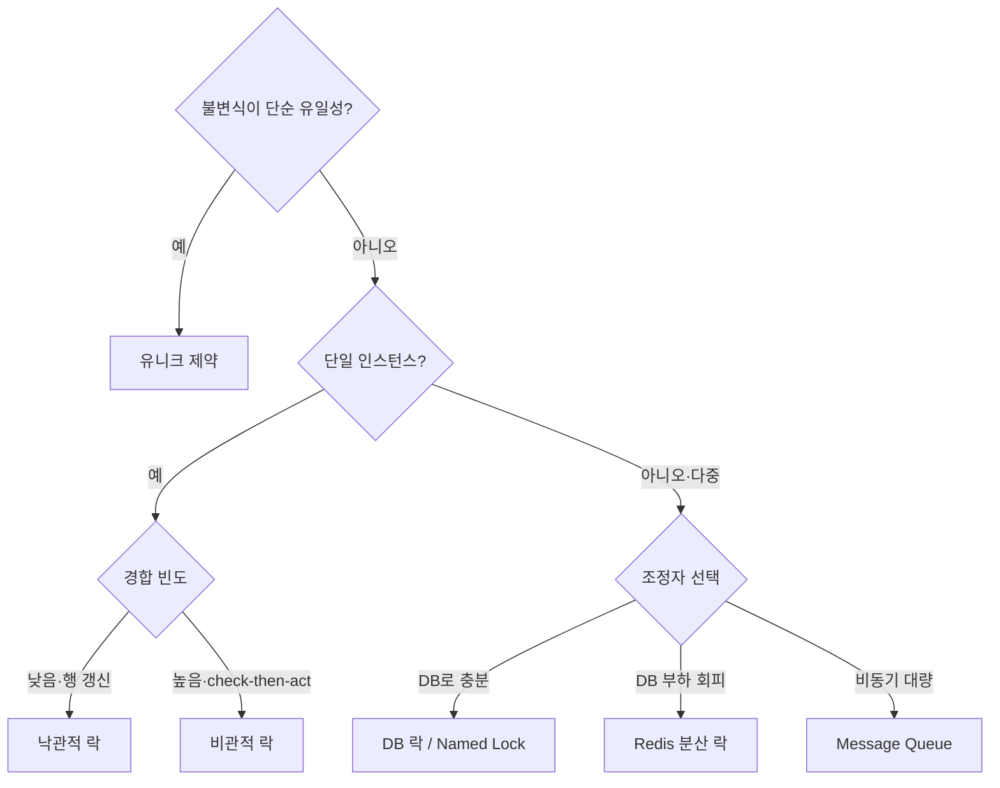

# 동시성 제어 방안 — 이론 정리

> 목적: 커플 연결(FR-2.5/2.6)처럼 **"검증 후 생성(check-then-act)"** 사이의 경쟁 조건을
> 어떤 방법으로 막을 수 있는지, 각 방법의 원리와 장단점을 정리한다.
> (구현 코드가 아니라 **선택의 근거**를 위한 문서)

---

## 1. 문제의 정체

동시성 버그는 대부분 아래 두 패턴 중 하나다.

### (a) Check-Then-Act (검증과 행위 사이의 틈)

"읽고 → 판단하고 → 쓴다"가 원자적이지 않아서 생긴다. 우리 FR-2.5가 정확히 이 케이스.

### (b) Lost Update (갱신 분실)

**핵심:** "여러 트랜잭션이 같은 자원을 동시에 건드릴 때, 불변식(invariant)을 어떻게 지킬 것인가"가 전부다.
해결책은 결국 **(1) 직렬화(순서를 강제)** 하거나 **(2) 충돌을 감지하고 한쪽을 실패**시키는 것 둘 중 하나로 수렴한다.

---

## 2. 방법 분류 한눈에 보기

| 계층 | 방법 | 전략 | 단일 인스턴스 | 다중 인스턴스 |
|---|---|---|:---:|:---:|
| DB | 유니크 제약 | 충돌 감지 | ✅ | ✅ |
| DB | 비관적 락 (`FOR UPDATE`) | 직렬화 | ✅ | ✅ |
| DB | 낙관적 락 (version) | 충돌 감지 | ✅ | ✅ |
| DB | 격리 수준 상향 | 직렬화/감지 | ✅ | ✅ |
| App | `synchronized`/`ReentrantLock` | 직렬화 | ✅ | ❌ |
| App | 키 단위 인메모리 락 | 직렬화 | ✅ | ❌ |
| 분산 | Redis 분산 락 | 직렬화 | ✅ | ✅ |
| 분산 | DB Named Lock | 직렬화 | ✅ | ✅ |
| 분산 | Message Queue | 직렬화 | ✅ | ✅ |

> 큰 그림: **DB 락/제약은 "DB가 이미 모두를 보는 단일 지점"이라 다중 인스턴스에도 자동으로 안전**하다.
> 반대로 **App 메모리 락은 그 JVM 안에서만 유효**해서 인스턴스가 2대 되는 순간 깨진다.
> Redis/MQ는 "공유되는 외부 조정자(coordinator)"를 따로 둬서 다중 인스턴스 문제를 푼다.

---

## 3. DB 계층

### 3.1 유니크 제약 (Unique Constraint)
**원리:** 불변식을 DB 스키마에 박아두고, 위반하는 INSERT는 DB가 거부(`DuplicateKey` 예외). 충돌을 *감지*해서 한쪽을 실패시키는 방식.

- **장점**
  - 가장 강력하고 단순. 애플리케이션 로직이 어떻든 DB가 최후의 보루로 막는다.
  - 락을 직접 관리할 필요 없음. 성능 오버헤드 거의 없음.
- **단점**
  - 표현할 수 있는 불변식이 제한적. "한 컬럼/컬럼조합이 유일" 정도는 쉽지만,
    **"PENDING/CONNECTED/DISCONNECTED 통틀어 유저당 1개"** 같은 *상태 의존 조건부 유일성*은 일반 유니크로 안 됨.
  - 우회책: **부분 인덱스(partial/filtered unique index)** — `WHERE status != 'DISCONNECTED'`인 행만 유일하게. 단 **H2는 부분 인덱스 미지원**(가정-1에서 이미 포기한 이유).
- **우리 케이스:** DISCONNECTED를 보존해야 해서 단순 유니크로 못 막음 → 그래서 앱 단 방어가 필요해진 것.

### 3.2 비관적 락 (Pessimistic Lock, `SELECT ... FOR UPDATE`)
**원리:** "충돌이 날 것이다"라고 비관적으로 가정. 자원을 읽을 때 **잠금을 걸어** 다른 트랜잭션을 *대기*시킨다. check-then-act 전체를 한 트랜잭션의 락 안에 넣어 직렬화한다.

- **장점**
  - check-then-act를 확실히 직렬화. 우리 같은 "읽고 판단해서 쓰는" 로직에 딱 맞음.
  - DB가 락을 관리하므로 **다중 인스턴스에서도 그대로 안전**.
- **단점**
  - 잠금 대기 → **처리량 저하**. 경합이 심하면 병목.
  - **데드락 위험**: 두 트랜잭션이 서로 다른 순서로 여러 행을 잠그면 교착.
    → 방어: **잠글 자원을 항상 같은 순서로 획득**(예: 두 유저 PK 오름차순). FR-2.6이 채택한 방식.
  - 락 점유 중 락 타임아웃/커넥션 점유 관리 필요.
- **언제:** 충돌 빈도가 꽤 있고, 충돌 시 "한쪽을 기다렸다 정상 처리"하고 싶을 때.

### 3.3 낙관적 락 (Optimistic Lock, version 컬럼)
**원리:** "충돌은 드물 것이다"라고 낙관. 락을 안 걸고, 대신 행에 `version` 컬럼을 둬서 **UPDATE 시점에 버전이 그대로인지 확인**. 누가 먼저 바꿨으면 버전이 안 맞아 실패(`OptimisticLockException`) → 재시도.

- **장점**
  - 락 대기가 없어 **경합이 적을 때 처리량이 좋다**.
  - 데드락 없음.
- **단점**
  - 충돌 시 **재시도 로직이 필요**. 경합이 심하면 재시도 폭증으로 오히려 비효율.
  - **기존 행 UPDATE에는 잘 맞지만, "새 행 INSERT를 막는" 우리 케이스엔 직접 안 맞음**
    (막을 행 자체가 아직 없으니 비교할 version이 없다). FR-2.3의 PENDING→CONNECTED *전이*엔 유효.
- **언제:** 같은 행을 갱신하는 경합(잔액, 재고 차감 등)에서 경합이 낮을 때.

### 3.4 트랜잭션 격리 수준 (Isolation Level)
**원리:** READ COMMITTED → REPEATABLE READ → SERIALIZABLE로 올릴수록 DB가 더 강하게 동시 실행을 마치 순차 실행처럼 보이게 보장. SERIALIZABLE은 사실상 충돌을 감지/직렬화.

- **장점:** 코드 변경 없이 DB 설정만으로 이상현상(dirty/non-repeatable/phantom read) 차단.
- **단점:** 높일수록 **락 범위·충돌·성능 비용 급증**. SERIALIZABLE은 직렬화 실패 시 재시도 필요. 보통 과한 선택.
- **언제:** 특정 트랜잭션만 국소적으로 격리를 올리는 정도. 전역 SERIALIZABLE은 권장 안 함.

---

## 4. Application 계층 (단일 인스턴스 전제)

### 4.1 `synchronized` / `ReentrantLock`
**원리:** JVM 안에서 임계 영역(critical section)을 한 스레드만 들어가게 직렬화.

- **장점:** 인프라 없이 가장 간단. DB 락보다 가벼움.
- **단점**
  - **JVM 단위 → 인스턴스 2대 이상이면 무력**(각 JVM이 독립 락). 스케일아웃 불가능 구조가 됨.
  - 임계 영역 안에 DB 트랜잭션을 통째로 넣으면 **트랜잭션 경계와 락 경계가 어긋나** 미묘한 버그(락 해제 후 commit 등) 위험.
  - 전체를 한 락으로 묶으면 무관한 유저끼리도 직렬화 → 처리량 저하.

### 4.2 키 단위 인메모리 락
**원리:** "유저 X"라는 키별로 락 객체를 만들어(예: 키→Lock 맵) 같은 키만 직렬화. 무관한 유저는 병렬 유지.

- **장점:** 전역 락보다 처리량 좋음. 인프라 불필요.
- **단점:** 역시 **단일 인스턴스 한정**. 키 맵의 메모리/정리 관리 필요. 다중 인스턴스 가면 그대로 깨짐.

> **결론(App 락):** 단일 인스턴스 토이/내부 도구엔 충분하지만, **다중 인스턴스로 갈 가능성이 조금이라도 있으면
> 처음부터 DB 락이나 분산 락으로 가는 게 안전**하다. App 락은 "스케일아웃하면 조용히 깨지는" 함정이 있다.

---

## 5. 분산 환경 (다중 인스턴스)

여러 인스턴스가 하나의 불변식을 지켜야 하면, **모두가 공유하는 단일 조정 지점**이 필요하다.
DB 자체가 그 역할을 이미 하지만(3장), 별도 조정자를 두는 선택지가 Redis와 MQ다.

### 5.1 Redis 분산 락
**원리:** Redis의 원자 연산(`SET key val NX PX ttl`)으로 "락 키를 먼저 선점한 쪽만 임계 영역 진입". TTL로 락 보유자가 죽어도 자동 해제. (라이브러리: Redisson 등. 다중 마스터 안전성을 위한 알고리즘이 Redlock.)

- **장점**
  - **다중 인스턴스에서 동작**. DB에 락 부하를 주지 않고 빠름(인메모리).
  - 락 키를 "유저 X"처럼 잘게 쪼개 경합 최소화 가능.
- **단점**
  - **인프라 추가**(Redis 운영·HA). 사이드 프로젝트엔 부담.
  - **정확성 함정**: TTL 만료 후에도 원 보유자가 임계 영역에 남아 있으면 두 명이 동시에 락을 "가졌다고 믿는" 상황 발생 가능 → **펜싱 토큰(fencing token)** 등 보완 필요. "분산 락은 생각보다 정확히 하기 어렵다"는 게 정설.
  - 락 해제는 반드시 **자기가 건 락만** 풀어야 함(원자적 검사+삭제 필요).
- **언제:** 다중 인스턴스 + DB 락으로 풀기 곤란하거나 DB 부하를 피하고 싶을 때.

### 5.2 DB Named Lock (예: MySQL `GET_LOCK`)
**원리:** DB가 제공하는 "이름표 락"을 받아 임계 영역 직렬화. 행이 아니라 임의 문자열 키에 거는 어드바이저리 락.

- **장점:** **이미 있는 DB를 조정자로 재사용** → 인프라 추가 없음. 다중 인스턴스 안전.
- **단점:** DB 종류에 종속(H2엔 동일 기능 없음). 커넥션과 락 수명 관리 주의. DB 부하 집중.
- **언제:** Redis 도입은 부담스럽지만 다중 인스턴스 직렬화가 필요하고 DB가 지원할 때.

### 5.3 Message Queue (단일 소비자/파티셔닝으로 직렬화)
**원리:** "커플 연결 요청"을 큐에 넣고, **특정 키(유저 X)는 항상 같은 파티션/단일 소비자**가 처리하게 라우팅 → 같은 유저의 요청이 자연히 순서대로(직렬) 처리됨. 락이 아니라 **"애초에 동시에 실행되지 않게" 만드는** 접근.

- **장점**
  - 직렬화가 구조적으로 보장(락 경합·데드락 자체가 없음).
  - 부하 분산·재시도·피크 흡수(buffering) 등 부가 이점.
- **단점**
  - **동기 API와 안 맞음**: 요청-응답이 비동기가 되어 "연결 성공/실패"를 즉시 못 돌려줌 → UX·정합성 설계 복잡(폴링/콜백/상태 조회 필요).
  - 인프라(브로커) 추가, 운영 복잡도 大. **순서 보장·정확히 한 번 처리(exactly-once)** 는 또 다른 난제.
  - 우리처럼 "즉시 결과가 필요한 단발성 연결"엔 과한 구조.
- **언제:** 대량 쓰기·이벤트 처리, 비동기로 풀어도 되는 워크플로, 키 기준 자연 직렬화가 잘 맞을 때.

---

## 6. 선택 가이드 — 무엇을 언제 쓰나

> **App 메모리 락**은 트리에 넣지 않았다 — "절대 스케일아웃 안 한다"가 확실할 때만 쓰는 예외. 아니면 함정.

---

## 7. 이 프로젝트(커플 연결)의 결론

- **상황:** 단일 인스턴스 + H2, "유저당 커플 1개(상태 무관)" + DISCONNECTED 보존 → **부분 유니크 불가**(3.1).
- **불변식 형태:** 단순 유일성이 아니라 *상태 조건부* + INSERT 차단형이라 낙관적 락도 부적합(3.3).
- **선택: DB 비관적 락**(`PESSIMISTIC_WRITE`)으로 두 유저 row를 **PK 오름차순으로 잠근 뒤** check-then-act 수행 → FR-2.6.
  - 이유: 인프라 추가 없이(H2/JPA 기본 기능) check-then-act를 확실히 직렬화. 다중 인스턴스로 가도 그대로 안전.
  - 데드락은 잠금 순서 고정으로 회피.
- **분산 락(Redis)·MQ는 도입 안 함**: 단일 인스턴스에 오버킬. 트래픽이 커져 인스턴스를 늘리게 되면
  비관적 락은 그대로 유효하고, 그때 DB 부하가 문제되면 Redis 분산 락으로 *교체*를 검토(코드 변경 국소적).

---

### 참고 개념 한 줄 정리
- **직렬화 vs 충돌 감지**: 락(비관적/분산/Named/App)은 전자, 유니크·낙관적 락은 후자.
- **조정 지점이 어디냐**가 다중 인스턴스 안전성을 가른다: JVM 메모리(❌ 공유 안 됨) vs DB/Redis/브로커(✅ 공유됨).
- **락은 항상 같은 순서로** 걸어 데드락을 피한다.
- 분산 락은 "쉬워 보이지만 정확히 하긴 어렵다" — TTL·펜싱·소유권 확인이 필수.
