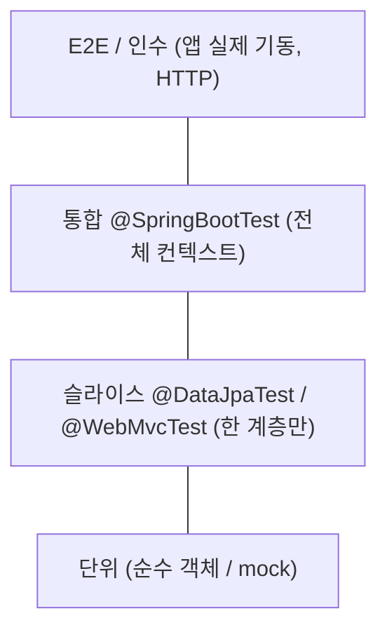
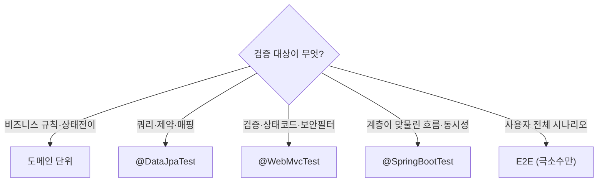
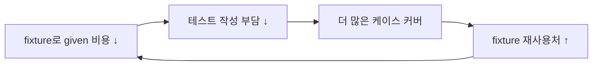

# 테스트 종류 — 이론 정리

> 목적: Spring Boot(Kotlin) 프로젝트에서 쓸 수 있는 테스트 "종류"를 좁은 것→넓은 것 순으로 정리하고,
> 각각의 원리·장단점·언제 쓰나를 본다. 그리고 **사이드 프로젝트에서 실제로 할 만한 조합**을 고른다.
> (테스트 코드가 아니라 **선택의 근거**를 위한 문서. 케이스 목록은 [`../test-cases.md`](../test-cases.md))

---

## 1. 큰 그림 — 테스트 피라미드



**핵심 원리:** 아래로 갈수록 **빠르고·많이·자주** 돌리고, 위로 갈수록 **느리고·적게·가끔** 돌린다.
"넓게 검증할수록 비싸고 깨지기 쉽다(느림·flaky·원인 추적 난해)." 그래서 **검증하려는 규칙을 잡을 수 있는 가장 좁은 테스트**를 고르는 게 원칙이다.

| 종류 | 격리 범위 | Spring 컨텍스트 | 속도 | 무엇을 잡나 |
|---|---|:---:|:---:|---|
| 단위(도메인) | 객체 하나 | ❌ | ⚡⚡ | 비즈니스 규칙·상태 전이·검증 |
| 단위(서비스+mock) | 서비스 1개, 협력자 가짜 | ❌ | ⚡ | 분기·협력 객체 호출 흐름 |
| 슬라이스 `@DataJpaTest` | 영속 계층 | 부분(JPA만) | 🚶 | 쿼리·매핑·제약 |
| 슬라이스 `@WebMvcTest` | 웹 계층 | 부분(MVC만) | 🚶 | 검증·직렬화·보안필터·상태코드 |
| 통합 `@SpringBootTest` | 전 계층 | 전체 | 🐢 | 계층이 맞물린 시나리오·동시성 |
| E2E/인수 | 기동된 앱 | 전체+네트워크 | 🐢🐢 | 사용자 관점 전체 흐름 |

---

## 2. 단위 테스트 (Unit)

### 2.1 도메인 단위 — 순수 객체
**원리:** 프레임워크/DB 없이 도메인 객체만 생성해서 메서드를 직접 호출. `Couple(...).connect()`처럼.

- **장점**
  - 가장 빠르고(밀리초) 안정적. 실패하면 원인이 한 곳으로 좁혀짐.
  - 비즈니스 규칙이 한곳(도메인)에 모여 있으면 **ROI가 가장 높다**.
  - CLAUDE.md의 "도메인 순수성" 원칙과 정확히 일치 — DB 없이 규칙을 검증.
- **단점**
  - 도메인이 프레임워크/DB에 의존하면(엔티티에 JPA가 새어들면) 못 함 → 애초에 도메인을 순수하게 둬야 가능.
  - "객체끼리 잘 연결됐는지"는 못 본다(그건 위 계층 몫).
- **언제:** 상태 전이·검증·계산 같은 **규칙**. 이 프로젝트 테스트의 1순위.

### 2.2 서비스 단위 — 협력자 mock
**원리:** Service만 떼어내고 Repository 등 협력 객체를 가짜(MockK)로 주입. "Service가 올바른 분기로 협력자를 호출하는가"를 검증.

- **장점:** Spring·DB 없이 서비스 로직 분기를 빠르게 검증.
- **단점**
  - **mock이 실제와 다르게 동작하면 통과해도 헛것**(false confidence). 쿼리 정확성은 못 잡는다.
  - 과하게 쓰면 "구현을 그대로 베낀 테스트"가 되어 리팩터링마다 깨짐(과한 결합).
- **언제:** 분기·예외 처리·호출 순서가 중요한 서비스. 단순 위임은 굳이 안 함.

---

## 3. 슬라이스 테스트 (Spring Slice)

> Spring 컨텍스트를 **필요한 계층만** 부분 로딩 → 통합보다 빠르면서 그 계층의 진짜 동작을 본다.

### 3.1 `@DataJpaTest` — 영속 계층
**원리:** JPA/Repository 관련 빈만 로딩하고 인메모리 DB(H2)로 실제 쿼리를 실행. 트랜잭션 자동 롤백.

- **장점**
  - "JPA 매핑·쿼리·제약이 의도대로 동작하나"를 실제 SQL로 검증. mock으론 못 잡는 영역.
  - 빠른 편(웹·서비스 빈 안 띄움).
- **단점**
  - H2와 실제 운영 DB(예: Postgres) 문법·동작 차이가 있으면 괴리. (이 프로젝트는 H2가 운영도 겸하니 무관.)
  - 단순 CRUD까지 다 덮으면 가치 대비 양만 늘어남.
- **언제:** **커스텀 쿼리·unique 제약·복잡 조회**. 예: email_enc unique, 캘린더 통합 조회, 물리 삭제 범위.

### 3.2 `@WebMvcTest` — 웹 계층
**원리:** Controller·검증·필터·직렬화만 로딩(Service는 mock). MockMvc로 HTTP를 흉내내 요청/응답을 검증.

- **장점**
  - 입력 검증(400)·상태코드·JSON 형태·**보안필터(401/403)** 를 서버 기동 없이 검증.
  - spring-security-test로 토큰 claim(`coupled` 등)을 손쉽게 흉내(`jwt()` 등).
- **단점**
  - Service가 mock이라 **진짜 비즈니스 동작은 검증 못 함**(웹 입출력 계약만).
  - 보안 설정을 정확히 같이 로딩하도록 신경 써야 함.
- **언제:** **접근 게이트·입력 검증·에러 응답 형식**. 이 프로젝트에선 게이트(FR-3) 검증의 주력.

---

## 4. 통합 테스트 (`@SpringBootTest`)

**원리:** 전체 애플리케이션 컨텍스트를 띄워 Controller→Service→Repository→DB가 실제로 맞물려 돌아가는지 검증. MockMvc 또는 TestRestTemplate으로 호출.

- **장점**
  - 계층이 합쳐졌을 때만 드러나는 문제(트랜잭션 경계, 락, 설정 누락)를 잡는다.
  - **동시성·전체 흐름**은 여기서만 제대로 검증 가능.
- **단점**
  - **느리다**(컨텍스트 로딩). 많이 만들면 테스트 스위트 전체가 무거워짐.
  - 실패 시 원인 범위가 넓어 디버깅 비용이 큼.
- **언제:** **핵심 happy-path 한두 개 + 동시성**. 예: 커플 연결 전체 흐름, 비관적 락으로 row 1개 보장.

---

## 5. E2E / 인수 테스트

**원리:** 앱을 실제로 기동하고(때론 별 프로세스) 외부에서 HTTP로 사용자 시나리오를 그대로 재현.

- **장점:** 사용자 관점의 "진짜 동작"을 검증. 배포 직전 안전망.
- **단점:** **가장 느리고 깨지기 쉽다**(flaky). 환경·데이터 셋업 비용 큼.
- **언제:** 미션 크리티컬한 핵심 플로우 극소수. **사이드 프로젝트엔 보통 오버킬**.

---

## 6. 선택 가이드 — 무엇을 언제 쓰나



> 원칙 한 줄: **"이 규칙을 잡을 수 있는 가장 좁은(=빠른) 테스트는 무엇인가?"** 를 매번 묻는다.
> 넓은 테스트로 좁은 규칙을 잡으면 느리고 깨지기 쉽다.

---

## 7. 이 프로젝트(사이드)의 결론

트래픽·운영 부담이 작은 사이드 프로젝트이므로 **피라미드 아래쪽에 투자하고, 위쪽은 핵심만** 둔다.

| 우선순위 | 종류 | 어디에 | test-cases.md |
|:---:|---|---|---|
| ⭐⭐⭐ | 도메인 단위 | Couple 상태전이·PENDING 만료·잠금, Schedule 불변식, 입력검증 | `C-U*`, `S-U*`, `U-V*` |
| ⭐⭐⭐ | `@DataJpaTest` | email_enc unique·결정적 암호화, 커플 1개 제한 쿼리, 캘린더 통합 조회, 물리 삭제 범위 | `U-I3/4`, `S-I8`, `C-I14` |
| ⭐⭐ | `@WebMvcTest` | 접근 게이트(401/403), 입력검증 400, 에러 형식 | `G-*`, `U-V*` |
| ⭐ | `@SpringBootTest` | 커플 연결 전체 흐름 + **동시성 락(row 1개 보장)** | `C-I2/3`, `C-I8` |
| ❌ | E2E·부하·뮤테이션·커버리지 강박 | 도입 안 함 | — |

**덜어내는 것**
- E2E·부하 테스트, 커버리지 100% 강박, 모든 CRUD에 통합 테스트 다는 것 → 오버킬.
- 동시성도 "락으로 row 1개"(`C-I8`) 하나면 충분. 데드락 정밀 재현(`C-I10`)은 코드 리뷰(잠금 순서 고정, [`concurrency.md`](./concurrency.md))로 갈음.

**도구**
- 러너: JUnit5(Spring Boot 기본), 단정: AssertJ 또는 Kotest
- 모킹: **MockK**(Kotlin 친화)
- 보안: **spring-security-test**(`jwt()`, `@WithMockUser`)

---

## 8. given 절(테스트 데이터 준비) 작성 원칙

> 출처 정리: 카카오페이 기술블로그 "given 테스트 코드 2편"을 이 프로젝트 기준으로 다듬음.
> 앞 절(1~7)이 **어떤 종류의 테스트를 고를까**였다면, 이 절은 그 테스트의 **given(준비) 절을 어떻게 쓸까**다.

테스트는 보통 given(준비)·when(실행)·then(검증)으로 나뉜다. 이 중 **given이 비대해지면** 테스트의 의도가 묻히고, 작성이 번거로워 "테스트를 안 짜게" 된다. 글이 지적하는 두 가지 함정과, 이 프로젝트에서 쓸 처방:

### 8.1 함정 ① 파라미터 지옥

**증상:** 객체 하나 만들려고 관심사와 무관한 필드까지 전부 채운다.

```kotlin
// ❌ 이 테스트가 보려는 건 "PENDING 만료"인데, 나머지 필드가 의도를 가린다
val couple = Couple(
    id = 1L, memberAId = 10L, memberBId = 20L,
    status = PENDING, invitedAt = ..., connectedAt = null,
    nickname = "...", themeColor = "...", /* ... 그 외 다수 */
)
```

- 핵심 의도(여기선 `status`/만료시각)가 잡음에 묻힌다.
- 엔티티에 필드 하나 추가되면 **모든 테스트가 깨진다.**

**처방: Fixture(오브젝트 마더) + 기본값 인자.** 테스트용 객체 생성을 한 곳(`fixture`)에 모으고, 모든 인자에 기본값을 준다. 테스트는 **관심 있는 필드만** 덮어쓴다.

```kotlin
// src/test/kotlin/.../fixture/CoupleFixture.kt
object CoupleFixture {
    fun couple(
        id: Long = 1L,
        memberAId: Long = 10L,
        memberBId: Long = 20L,
        status: CoupleStatus = CONNECTED,
        invitedAt: Instant = Instant.parse("2026-01-01T00:00:00Z"),
    ): Couple = Couple(id, memberAId, memberBId, status, invitedAt /* ... */)
}

// 테스트: 관심 필드만 지정 → 의도가 또렷하다
val pending = CoupleFixture.couple(status = PENDING, invitedAt = expiredTime)
```

- **의도가 드러난다** — 덮어쓴 인자가 곧 "이 테스트가 신경 쓰는 것".
- **변경 한 곳** — 엔티티가 바뀌면 fixture만 고친다.
- 코틀린 named/default 인자가 빌더를 대체하므로 별도 빌더 클래스는 **오버킬**.

### 8.2 함정 ② Mocking 지옥 (IO 객체)

**증상:** 외부 호출(알림 전송 등)을 mock할 때 넘기는 요청 객체가 도메인 객체와 필드가 잔뜩 겹치는데, 그걸 또 손으로 다 채운다.

**처방: 이미 만든 도메인 객체에서 파생시키는 IO Fixture.** 겹치는 필드는 도메인 객체에서 가져오고, IO 고유 필드(수신자·제목 등)만 인자로.

```kotlin
object NotificationFixture {
    fun connectedNotification(
        couple: Couple,                     // 도메인 객체 재사용
        toEmail: String = "test@test.com",  // IO 고유 필드만 기본값
    ): NotificationRequest = NotificationRequest(
        coupleId = couple.id,               // 겹치는 필드는 파생
        toEmail = toEmail,
    )
}
```

- 도메인 fixture가 바뀌어도 IO fixture가 **자동으로 따라온다**(중복 0).

### 8.3 함정 ③ 멀티모듈 재사용 — 이 프로젝트는 해당 없음

원문은 Gradle 멀티모듈에서 `src/test` 코드가 모듈 간 공유 안 되는 문제를 `java-test-fixtures` 플러그인(`src/testFixtures`)으로 푼다.

> **이 프로젝트는 단일 모듈**이므로 지금은 불필요. fixture는 그냥 `src/test/.../fixture/`에 둔다.
> 나중에 모듈을 쪼개게 되면(domain/api/batch 등) 그때 `java-test-fixtures` 도입을 검토한다. ([CLAUDE.md](../../CLAUDE.md) 단순함 우선)

### 8.4 핵심: 스노우볼 효과

글의 결론은 **given을 싸게 만들면 테스트가 굴러간다**는 것:



- 도메인 fixture를 만들어 두면 단위→슬라이스→통합 테스트로 올라가며 **계속 재사용**된다.
- 작은 단위(도메인)부터 fixture를 깔고 위 계층으로 확장 — 7절의 우선순위(아래쪽에 투자)와 정확히 맞물린다.

### 8.5 이 프로젝트의 규칙 (한 줄 요약)

- given 객체 생성은 **fixture 함수 한 곳**에 모은다. 모든 인자에 **기본값**.
- 테스트는 **관심 있는 필드만** 덮어쓴다 — 나머지는 기본값.
- IO/요청 객체는 **도메인 fixture에서 파생**시켜 중복을 없앤다.
- 빌더 클래스·멀티모듈 testFixtures는 **지금은 안 함**(코틀린 기본 인자로 충분, 단일 모듈).

---

### 참고 개념 한 줄 정리
- **좁을수록 빠르고 안정적, 넓을수록 비싸고 flaky** — 규칙을 잡는 가장 좁은 테스트를 고른다.
- **mock은 빠르지만 "실제와 다르면" 헛통과** — 쿼리·제약은 `@DataJpaTest`로 진짜 검증.
- **도메인을 순수하게 유지**해야 단위 테스트가 가능 — 테스트 용이성은 구조(도메인 순수성)에서 나온다.
- 동시성·트랜잭션처럼 **계층이 맞물려야 드러나는 것**만 `@SpringBootTest`로.
- **given은 fixture로 싸게** — 기본값 인자 + 관심 필드만 덮어쓰기. given 비용이 낮아야 테스트가 굴러간다(스노우볼).
